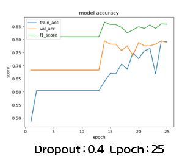

# Telegram SwearWord&Target Detector
##### Telegram SwearWord and Target Detector using CNN and Konlpy.

## OUTLINE
* Korean swear detection using CNN and wordembeding(Fasttext).
* Used Konlpy to find target inside sentence(Target Detector).
* Uses Telegram to test performance, and to prove Swear detections potential for real life use.
* Collected data from "Naver news", "Dcinside" etc.

## Requirements
* Tensorflow
* Konlpy
* Telegram API 

## Performance

## Reference : 
* https://github.com/smothly/BadWordDetection
